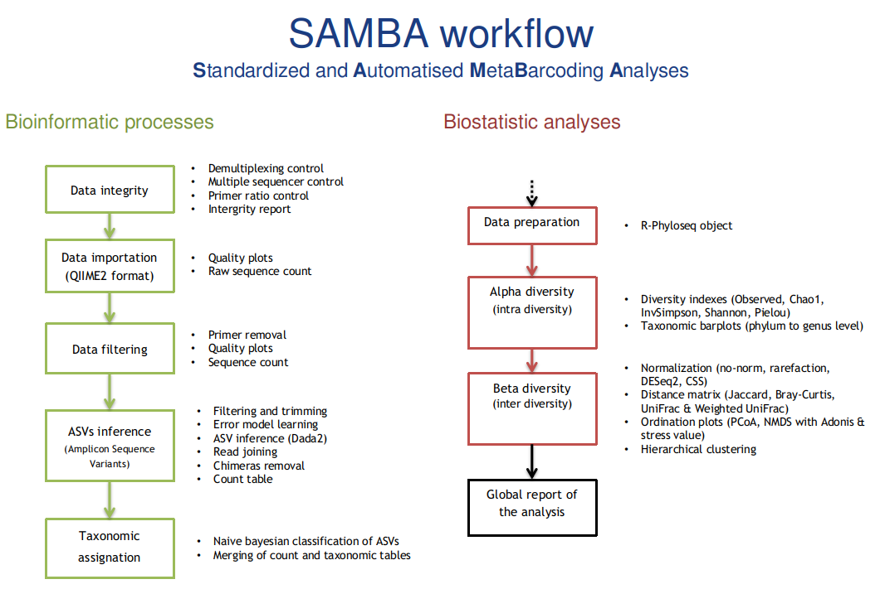

# SAMBA
## Standardized and Automated MetaBarcoding Analysis workflow using Nextflow

[]()
[](https://gitlab.ifremer.fr/bioinfo/SAMBA-nextflow)
[](https://www.nextflow.io/)
[](https://docs.conda.io/en/latest/)
[](https://www.r-project.org/)



## How to install

### How to get this worflow
#### For Ifremer users
```bash
# connect to datarmor
ssh datarmor
# get a local copy of the workflow in the directory SAMBA-nextflow
git clone https://gitlab.ifremer.fr/bioinfo/SAMBA-nextflow
cd SAMBA-nextflow
# get stable SAMBA version 1.0.1
git checkout v1.0.1
```

### For other users
```bash
# get a local copy of the workflow in the directory SAMBA-nextflow
git clone https://gitlab.ifremer.fr/bioinfo/SAMBA-nextflow
cd SAMBA-nextflow
# get stable SAMBA version 1.0.1
git checkout v1.0.1
```
This workflow uses conda to resolve process dependencies, please be sure to have the following dependencies installed beforehand:
- Conda >=4.8.1 binary in your PATH or a conda init file in your environment -> https://docs.anaconda.com/anaconda/user-guide/faq/
- Nextflow >=20.01.0 -> conda install -c bioconda nextflow=20.01.0

For nextflow, update the following files conf/conda_envs/nextflow_env.sh and conf/conda_envs/delenv.sh to fit your environment's paths

SAMBA is written to be executed on a grid cluster with PBS Professionnal scheduler. If your scheduler is different, change the executor name in the file conf/resources.config.

### To test the workflow
```bash
# Enter in your local copy
cd SAMBA-nextflow
# Run the workflow
./RunSAMBA_training_dataset.sh 
```
At the end of the workflow, have a look at the html report : SAMBA_results_of_training_dataset_project/00_report/Report_training_dataset_project.html

## How to use with your own data

### Input files

Create a folder containing:

* dna-sequence-raw : a folder with all your R1 and R2 fastq.gz files [required] 
For Ifremer users, this folder is normally already created in the DATAREF folder of your project

* q2\_manifest : tabular file with sample name and path to corresponding R1 and R2 fastq.gz files [required]
For Ifremer users, the paths to your files can point directly to DATAREF

Mandatory columns are listed below :

sample-id | forward-absolute-filepath | reverse-absolute-filepath 
:---: | :---: | :---:
sample1 | /path/to/sample1-R1.fastq.gz | /path/to/sample1-R2.fastq.gz
sample2 | /path/to/sample2-R1.fastq.gz | /path/to/sample2-R2.fastq.gz
sample3 | /path/to/sample3-R1.fastq.gz | /path/to/sample3-R2.fastq.gz

* q2\_metadata : tabular file describing samples metadata (prefer to use "\_" for long variable names) [required]

Mandatory columns are sample-id and barcode. For your metadata colums, prefer to use "\_" to name your variables :

sample-id | barcode | metadata\_1 | metadata\_2
:---: | :---: | :---: | :---:
sample1 | ATTAC | metadata1 | A
sample2 | ACTGA | metadata1 | B
sample3 | CTTCA | metadata2 | B

* [inasv\_table] : ASV table to use as input if running only statistics steps [optional]

### Workflow parameters

* nextflow.config : general configs for Nextflow (set TMPDIR, Workdir...). Check this file and adapt to your environment !
* conf/base.config : workflow workdir definition, processes (tasks) parameters and activation. Check this file and adapt to your data !
* conf/resources.config : scheduler resources to attribute to each process. Check this file and adapt to your scheduler !
* conf/report.config : nextflow automatic reports parameters 
* main.nf : each step is described within its command line

### How to run
Don't forget to modify nextflow config files before running the workflow (see nextflow.config and config directory).

Note : This workflow is design to run on a PBS pro cluster (See resources.config to change cluster options)

```bash
# RUN FROM SCRATCH
./RunSAMBA.sh

# RUN RESUME (when a task has failed or if you run steps separately)
./RunSAMBA.sh -resume
```

### References 

References databases (SILVA 132) are available on our [FTP](ftp://ftp.ifremer.fr/ifremer/dataref/bioinfo/sebimer/sequence-set/qiime2/2019.07/)
Training dataset used from [Qiime2 Tutorial] (https://docs.qiime2.org/2019.7/tutorials/atacama-soils/), [associated publication](https://msystems.asm.org/content/2/3/e00195-16)

### Contact

For any concerns/problems or suggestions, do not hesitate to [contact us](samba-sebimer@ifremer.fr)
