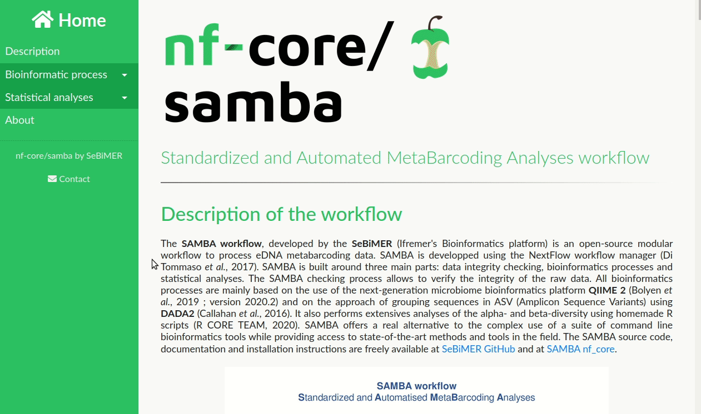

# 

**Standardized and Automated MetaBarcoding Analyses workflow (SAMBA)**.

[](https://www.nextflow.io/)
[](https://docs.conda.io/en/latest/)
[](https://www.docker.com/)
[](https://sylabs.io/docs/)
[](https://hub.docker.com/u/sebimer)

## Introduction

The pipeline is built using [Nextflow](https://www.nextflow.io), a workflow tool to run tasks across multiple compute infrastructures in a very portable manner. It comes with docker containers making installation trivial and results highly reproducible.

## Quick Start

i. Install [`nextflow`](https://nf-co.re/usage/installation)

ii. Install either [`Docker`](https://docs.docker.com/engine/installation/) or [`Singularity`](https://www.sylabs.io/guides/3.0/user-guide/) for full pipeline reproducibility (please only use [`Conda`](https://conda.io/miniconda.html) as a last resort; see [docs](https://nf-co.re/usage/configuration#basic-configuration-profiles))

iii. Download the pipeline and test it on a minimal dataset with a single command

* for short reads test :
```bash
nextflow run main.nf -profile shortreadstest,<docker/singularity/conda>
```

* for long reads test :
```bash
nextflow run main.nf -profile longreadstest,<docker/singularity/conda>
```

> Please check [nf-core/configs](https://github.com/nf-core/configs#documentation) to see if a custom config file to run nf-core pipelines already exists for your Institute. If so, you can simply download your institute custom config file and simply use `-c <institute_config_file>` in your command. This will enable either `docker` or `singularity` and set the appropriate execution settings for your local compute environment.

iv. Start running your own analysis!

```bash
nextflow run main.nf -profile <docker/singularity/conda>,custom [-c <institute_config_file>]
```

See [usage docs](docs/usage.md) for a complete description of all of the options available when running the pipeline.

## Documentation

The samba workflow comes with documentation about the pipeline, found in the `docs/` directory:

1. [Introduction](docs/usage.md)
2. [Pipeline installation](docs/usage.md#install-the-pipeline)
    * Local installation
    * [Adding your own system config](docs/usage.md#adding_own_config)
3. [Running the pipeline](docs/usage.md#running-the-pipeline)
4. [Output and how to interpret the results](docs/output.md)
5. [Troubleshooting](docs/troubleshooting.md)

Here is an overview of the many steps available in samba pipeline:


At the end of samba pipeline execution, you get an interactive HTML report that's look like this one:



Full report description is available in [samba pipeline documentation](docs/output.md).

## Credits

samba is written by [SeBiMER](https://ifremer-bioinformatics.github.io/), the Bioinformatics Core Facility of [IFREMER](https://wwz.ifremer.fr/en/).

## Contributions and Support

If you would like to contribute to this pipeline, please see the [contributing guidelines](.github/CONTRIBUTING.md).

For further information or help, don't hesitate to get in touch on [Slack](https://nfcore.slack.com/channels/samba) (you can join with [this invite](https://nf-co.re/join/slack)).

## Citation

<!-- If you use  samba for your analysis, please cite it using the following doi: [10.5281/zenodo.XXXXXX](https://doi.org/10.5281/zenodo.XXXXXX) -->

### References 

References databases (SILVA v132, PR2, UNITE) are available on IFREMER FTP at [ftp://ftp.ifremer.fr/ifremer/dataref/bioinfo/sebimer/sequence-set/SAMBA/2019.10](ftp://ftp.ifremer.fr/ifremer/dataref/bioinfo/sebimer/sequence-set/SAMBA/2019.10).

Training dataset used from [Qiime2 Tutorial] (https://docs.qiime2.org/2019.7/tutorials/atacama-soils), [associated publication](https://msystems.asm.org/content/2/3/e00195-16).
