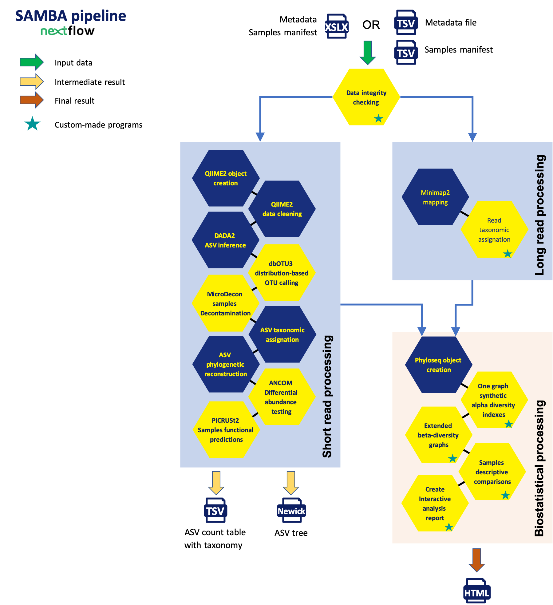

# **SAMBA: Standardized and Automated MetaBarcoding Analyses workflow**.

[](https://gitlab.ifremer.fr/bioinfo/SAMBA-nextflow)
[](https://www.nextflow.io/)
[](https://sylabs.io/docs/)
[](https://ifremer-bioinformatics.github.io/)

## Introduction

SAMBA is a FAIR scalable workflow integrating, into a unique tool, state-of-the-art bioinformatics and statistical methods to conduct reproducible eDNA analyses using [Nextflow](https://www.nextflow.io) (Di Tommaso *et al.*, 2017). SAMBA performs complete metabarcoding analysis by :
- verifying integrity of raw reads and metadata
- processing data using commonly used procedure with [QIIME 2](https://qiime2.org/) (version 2022.11 ; Bolyen *et al.*, 2019) and [DADA2](https://docs.qiime2.org/2022.11/plugins/available/dada2/?highlight=dada2) (Callahan *et al.*, 2016)
- adding new steps to build high quality ASV count tables by:
    - ASV clustering relying on either [dbOTU3](https://github.com/swo/dbotu3) (Olesen *et al.*, 2017) and [swarm](https://github.com/torognes/swarm) (Mahé *et al.*, 2014]
    - [microDecon](https://github.com/donaldtmcknight/microDecon) (McKnight *et al.*, 2019)
- conducting extended statistical and ecological analyses using homemade Rscript
- producing a full dynamic HTML report including resources used, commands executed, intermediate results, statistical analyses and figures

Optional processes can also be performed through SAMBA such as analysis of compositions of microbiomes using [ANCOM-BC](https://bioconductor.org/packages/devel/bioc/vignettes/ANCOMBC/inst/doc/ANCOMBC.html) (Lin & Peddada, 2020) and functional prediction analysis using [PICRUSt2](https://github.com/picrust/picrust2) (Douglas *et al.*, 2020). 

The SAMBA pipeline can run tasks across multiple compute infrastructures in a very portable manner. It comes with singularity containers making installation trivial and results highly reproducible.

## Quick Start

i. Install [`nextflow`](https://www.nextflow.io/docs/latest/getstarted.html#installation)

ii. Install [`Singularity`](https://www.sylabs.io/guides/3.0/user-guide/) for full pipeline reproducibility

iii. Download the pipeline and test it on a minimal dataset with a single command

* for short reads test :
```bash
nextflow run main.nf -profile shortreadstest,singularity
```

* for long reads test :
```bash
nextflow run main.nf -profile longreadstest,singularity
```

> To use samba on a computing cluster, it is necessary to provide a configuration file for your system. For some institutes, this one already exists and is referenced on [nf-core/configs](https://github.com/nf-core/configs#documentation). If so, you can simply download your institute custom config file and simply use `-c <institute_config_file>` in your command. This will enable `singularity` and set the appropriate execution settings for your local compute environment.

iv. Start running your own analysis!

```bash
nextflow run main.nf -profile singularity,custom [-c <institute_config_file>]
```

See [usage docs](docs/usage.md) for a complete description of all of the options available when running the pipeline.

## Documentation

The samba workflow comes with documentation about the pipeline, found in the `docs/` directory:

1. [Introduction](docs/usage.md#introduction)
2. [Pipeline installation](docs/usage.md#install-the-pipeline)
    * [Local installation](docs/usage.md#local-installation)
    * [Adding your own system config](docs/usage.md#your-own-config)
3. [Running the pipeline](docs/usage.md#running-the-pipeline)
4. [Output and how to interpret the results](docs/output.md)
5. [Troubleshooting](docs/troubleshooting.md)

Here is an overview of the many steps available in samba pipeline:



At the end of samba pipeline execution, you get an interactive HTML report that's look like this one:


Full report description is available in [samba pipeline documentation](docs/output.md).

## Credits

samba is written by [SeBiMER](https://ifremer-bioinformatics.github.io/), the Bioinformatics Core Facility of [IFREMER](https://wwz.ifremer.fr/en/).

## Contributions

We welcome contributions to the pipeline. If such case you can do one of the following:
* Use issues to submit your questions 
* Fork the project, do your developments and submit a pull request
* Contact us (see email below) 

## Support

For further information or help, don't hesitate to get in touch with the samba developpers: 


## Citation

<!-- If you use  samba for your analysis, please cite it using the following doi: [10.5281/zenodo.XXXXXX](https://doi.org/10.5281/zenodo.XXXXXX) -->

### References 
- Current singularity images are available on Ifremer FTP at [ftp://ftp.ifremer.fr/ifremer/dataref/bioinfo/sebimer/tools/SAMBA/v4](ftp://ftp.ifremer.fr/ifremer/dataref/bioinfo/sebimer/tools/SAMBA/v4)

<!-- References databases (SILVA v132, PR2, UNITE) are available on IFREMER FTP at [ftp://ftp.ifremer.fr/ifremer/dataref/bioinfo/sebimer/sequence-set/SAMBA/2019.10](ftp://ftp.ifremer.fr/ifremer/dataref/bioinfo/sebimer/sequence-set/SAMBA/2019.10).  -->

- Training dataset used from [Qiime2 Tutorial] (https://docs.qiime2.org/2019.7/tutorials/atacama-soils), [associated publication](https://msystems.asm.org/content/2/3/e00195-16).
